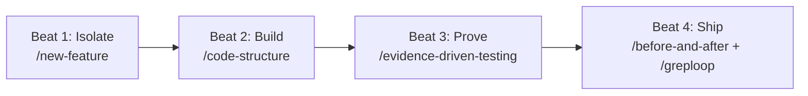

# Pinata Factory

A standardized, multi-agent **Software Factory** environment powered by the [Four-Beat Agent Workflow](AGENTS.md). 

Pinata Factory standardizes how AI agents and engineers collaborate to take feature requests and defect reports from idea to production-ready pull requests with automated verification, visual proof, and adversarial code reviews.

---

## The Four-Beat Workflow

Every task in this repository moves through the same four beats, backed by dedicated agent skills installed in [`.agents/skills/`](.agents/skills):



1. **Beat 1: Isolate (`/new-feature`)**
   - Every task starts in a dedicated, disposable Git worktree branched from `origin/main`.
   - Prevents branch collisions and allows multiple agents to swarm features in parallel.
2. **Beat 2: Build (`/code-structure`)**
   - Enforces a two-layer architecture: **Actions** orchestrate domain policy (when/why), while **Services** centralize reusable operational mechanics (how).
   - Keeps code composable, explicit, and free of database-leaking god services.
3. **Beat 3: Prove (`/evidence-driven-testing`)**
   - Replaces prose claims with concrete runtime proof.
   - Captures the "before" state while reproducing the issue, and the "after" state with live video/screenshot assertions.
4. **Beat 4: Ship (`/before-and-after`, `/greploop`)**
   - Automatically generates and uploads side-by-side visual diff tables into the PR.
   - Triggers an autonomous Greptile review loop, fixing actionable findings until a **5/5 confidence score** with zero unresolved comments is achieved.

### Writing for Humans (`/unslop`)
All commit messages, PR descriptions, and documentation are filtered through `/unslop` to strip AI tells (em dashes, chatbot phrases, filler hedging, marketing puffery) and restore concise, active-voice engineering prose.

---

## Quick Start

### 1. Check Toolchain Prerequisites
Verify that your local system has the required tooling installed:
```bash
./scripts/factory-doctor.sh
```

### 2. Available Skills
The repository ships with 7 pre-configured skills in `.agents/skills`:
- `new-feature`: Worktree isolation.
- `code-structure`: Service layer architecture.
- `unslop`: Human-first prose refactoring.
- `evidence-driven-testing`: Annotated live test recording.
- `before-and-after`: UI visual regression comparison.
- `greploop`: Autonomous 5/5 review loop.
- `greploop-apps`: Large-changeset Greptile review loop.

### 3. Agent Governance
Detailed instructions, execution constraints, and multi-agent invariants are specified in [**`AGENTS.md`**](AGENTS.md).
