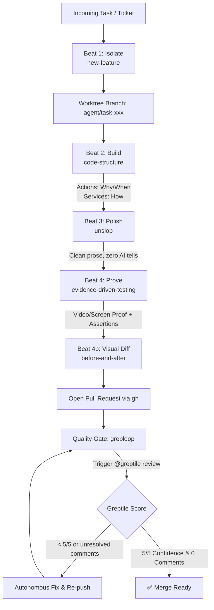

# Software Factory Operational Flow Plan

This document defines the architecture, workflow stages, and operational execution model for running a **Software Factory** in `pinata-factory` using the 7 agent skills installed from [`michaelshimeles/skills`](https://github.com/michaelshimeles/skills/tree/main).

---

## 1. Goal Description

A **Software Factory** is a standardized, repeatable assembly line where AI agents and engineers collaborate to take task specifications from idea to verified, production-ready code with minimal human overhead and zero architectural drift.

The 7 installed skills form a cohesive **Four-Beat Pipeline**:
1. **Beat 1: Isolate** ([`new-feature`](file:///Users/cesaradalbertochavezcalderon/Personal/pinata-factory/.agents/skills/new-feature/SKILL.md))
2. **Beat 2: Build & Architect** ([`code-structure`](file:///Users/cesaradalbertochavezcalderon/Personal/pinata-factory/.agents/skills/code-structure/SKILL.md))
3. **Beat 3: Humanize & Polish** ([`unslop`](file:///Users/cesaradalbertochavezcalderon/Personal/pinata-factory/.agents/skills/unslop/SKILL.md))
4. **Beat 4: Prove & Ship** ([`evidence-driven-testing`](file:///Users/cesaradalbertochavezcalderon/Personal/pinata-factory/.agents/skills/evidence-driven-testing/SKILL.md), [`before-and-after`](file:///Users/cesaradalbertochavezcalderon/Personal/pinata-factory/.agents/skills/before-and-after/SKILL.md), [`greploop`](file:///Users/cesaradalbertochavezcalderon/Personal/pinata-factory/.agents/skills/greploop/SKILL.md) / [`greploop-apps`](file:///Users/cesaradalbertochavezcalderon/Personal/pinata-factory/.agents/skills/greploop-apps/SKILL.md))



---

## 2. Factory Operational Lifecycle (The 4 Beats)

### Beat 1: Isolate (`new-feature`)
*Objective:* Isolate agent working contexts to allow concurrent multi-agent feature development without branch collisions, dirty working trees, or stash conflicts.

- **Trigger:** Beginning any new feature, bug fix, or task.
- **Workflow:**
  1. Synchronize remote baseline: `git fetch origin`.
  2. Scope check: inspect open pull requests (`gh pr list`) to ensure other agents aren't actively editing target files.
  3. Worktree creation: spawn an isolated directory under `.worktrees/<task-name>` branched from `origin/main`.
  4. Dependency sandbox: run fresh package installation in the worktree (`npm install` / `pnpm install`).
  5. Port arbitration: verify ports (`lsof -i :<port>`) before launching local dev servers.

---

### Beat 2: Build & Architect (`code-structure`)
*Objective:* Enforce clean separation of concerns so code remains composable, testable, and free from monolithic "god services".

- **The Two-Layer Separation:**
  - **Orchestration Layer (`actions/`):** Owns domain decisions (when to run, business policies, authorization, state transitions, user error formatting).
  - **Service Layer (`services/`):** Owns reusable operational mechanics (how to interact with external APIs, SDKs, bash commands, file parsers).
- **Core Rules:**
  - Service functions take explicit inputs and return structured results (`{ ready, previewUrl, error }`).
  - Service functions NEVER directly query or mutate database tables or session states.
  - No premature abstraction: single-caller logic stays inside the action until reused by 2+ callers.

---

### Beat 3: Humanize & Polish (`unslop`)
*Objective:* Eliminate synthetic AI phrasing, excessive hedging, marketing buzzwords, and structural tells from all agent-written artifacts.

- **Scope:** Applied to commit messages, PR descriptions, generated documentation, and code comments.
- **Rules Enforced:**
  - Punctuation: zero em dashes (use commas or periods), straight quotes only, no mid-sentence connector colons.
  - Vocabulary: eliminate AI crutch words (`delve`, `pivotal`, `tapestry`, `landscape`, `testament`).
  - Structure: active voice, sentence rhythm variation, concrete numbers instead of emotional descriptors.
  - Formatting: sentence-case headings, no decorative emojis in technical headers.

---

### Beat 4: Prove & Ship (`evidence-driven-testing`, `before-and-after`, `greploop`)
*Objective:* Replace unverifiable prose claims with concrete visual/execution proof, then submit the PR to an automated adversarial review loop.

#### 4A. Runtime Evidence (`evidence-driven-testing`)
- Capture the "before" state while reproducing the defect/baseline (when reproduction is cheapest).
- In GUI environments: record screen session via `evidence.py start/annotate/stop` with Jest-style assertion milestones burned into `evidence.mp4`.
- In Headless environments: drive automated Playwright script (`record.mjs`) producing numbered screenshots (`01-precondition.png`, `02-passed.png`) and `assertions.md`.

#### 4B. Visual Diffs (`before-and-after`)
- Run `before-and-after "<before-url>" "<after-url>" --markdown` to generate an uploaded side-by-side comparison table.
- Attach the table to the PR description using `gh pr edit`.

#### 4C. Adversarial Review Loop (`greploop` / `greploop-apps`)
- Submit PR and trigger Greptile automated review (`@greptile review` or `@greptile-apps review` for large PRs).
- Poll GitHub check-run or issue comment until review completes.
- Autonomous loop:
  1. Parse confidence score (e.g. `3/5`) and unresolved inline comments.
  2. If score is `< 5/5` or unresolved comments exist:
     - Read contextual code and comments.
     - Apply code modifications.
     - Resolve discussion threads via GraphQL mutation.
     - Commit with clear message and push.
     - Repeat until **5/5 Confidence** and **0 Unresolved Comments** are reached.

---

## 3. Tooling & Environment Prerequisites

To run this factory end-to-end, the following environment capabilities must be configured:

| Component | Required Tool | Purpose | Status in Repo |
|---|---|---|---|
| **VCS & PRs** | `git`, `gh` CLI | Worktrees, branch isolation, PR creation/edits | Available |
| **Visual Diffs** | `@vercel/before-and-after` | Screen capture & PR comparison tables | Installable via npm |
| **Evidence** | Python 3, `ffmpeg` (with `libx264` + `ass`) | Video session recording & burned assertion subtitles | Verify via `python3 scripts/evidence.py doctor` |
| **Headless Proof** | `playwright` (`npx --yes playwright`) | Headless browser execution & scripted screenshots | Available via npx |
| **Review Gate** | Greptile GitHub App | Automated PR code review & confidence scoring | Requires repo installation |

---

## 4. Proposed Factory Setup in `pinata-factory`

To establish `pinata-factory` as an active, working factory repository:

### 1. Configure Workspace Rules (`AGENTS.md`)
Create a root [`AGENTS.md`](file:///Users/cesaradalbertochavezcalderon/Personal/pinata-factory/AGENTS.md) that encodes the 4-Beat Factory workflow as the authoritative instruction set for all AI agents working in this repository.

### 2. Configure Directory Hygiene (`.gitignore`)
Ensure `.gitignore` tracks factory scratch folders so agent worktrees, video recordings, and local indexes are never accidentally committed:
```gitignore
# Worktrees
.worktrees/

# Evidence & artifacts
.artifacts/
*.mp4
*.ts
raw.ts

# Local runtime state
.atl/
```

### 3. Verify Toolchain (`factory check`)
Create a lightweight verification script or health check to validate that `gh`, `ffmpeg`, `@vercel/before-and-after`, and Python dependencies are satisfied.

---

## 5. User Review Required

> [!IMPORTANT]
> **Greptile Integration:** Does your GitHub repository have the Greptile GitHub App installed? `greploop` relies on `@greptile review` comments. If Greptile is not enabled, we can configure an alternative review authority (such as Antigravity dual review or GitHub Actions linters) for the review loop.

> [!NOTE]
> **Worktree Storage:** Do you prefer worktrees created in `.worktrees/<task-name>` (standard gitignored directory) or managed by your IDE harness?

---

## 6. Verification Plan

1. **Step 1:** Create [`AGENTS.md`](file:///Users/cesaradalbertochavezcalderon/Personal/pinata-factory/AGENTS.md) defining the Four-Beat Factory rules.
2. **Step 2:** Update [`.gitignore`](file:///Users/cesaradalbertochavezcalderon/Personal/pinata-factory/.gitignore) to protect worktrees and artifact captures.
3. **Step 3:** Perform a dry-run test of Beat 1 (`new-feature` worktree creation) to prove isolated branch instantiation.
